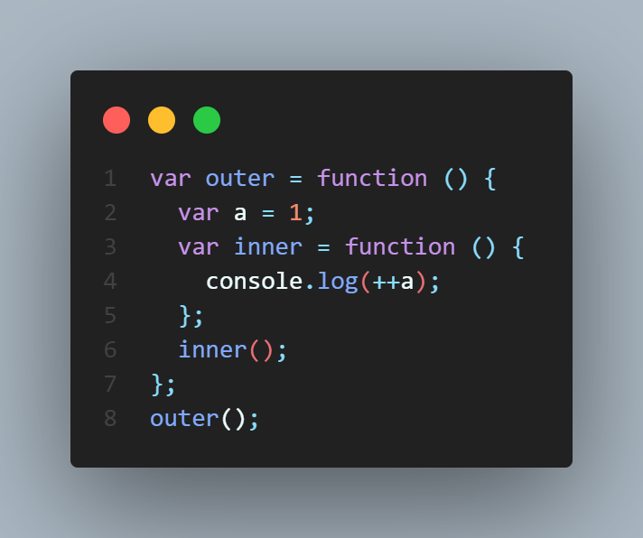
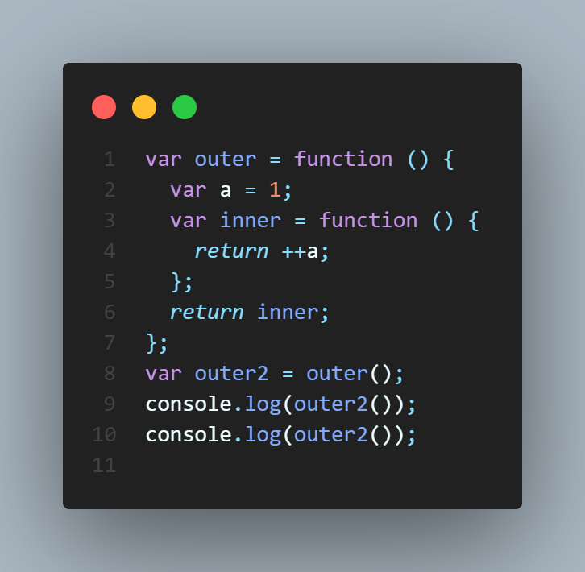
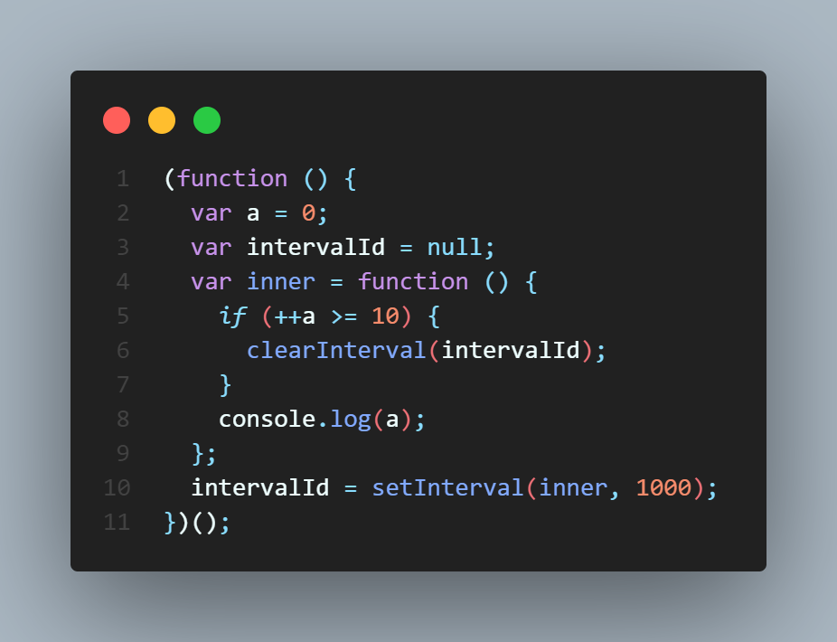
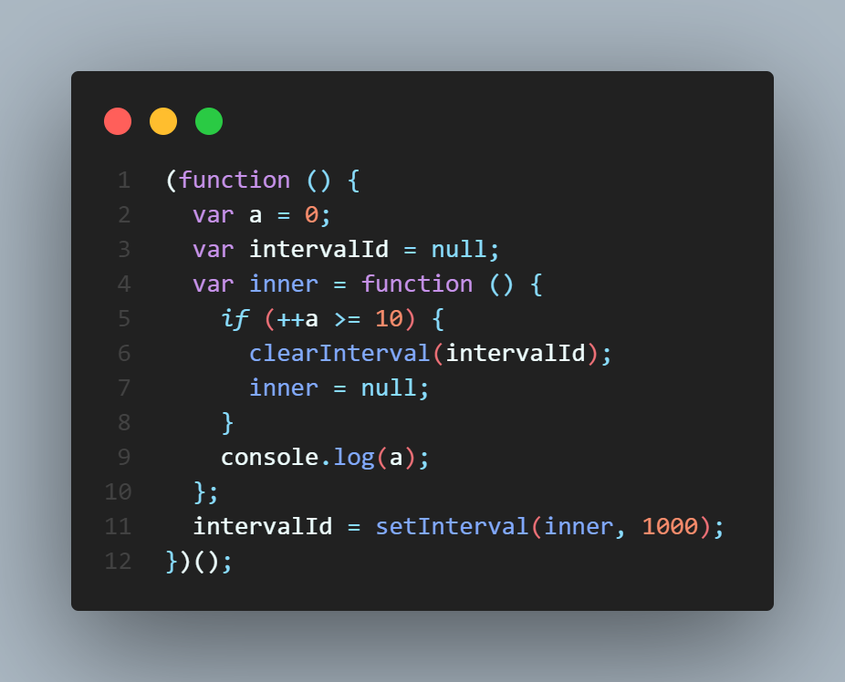

# 클로저의 의미 및 원리 이해

### 클로저란?

클로저는 함수와 그 함수가 선언될 당시의 lexical environment의 상호관계에 따른 현상 - MDN

예제 1

inner함수 내부에서 a를 선언하지 않았기 때문에 environmentRecord에서 값을 찾지 못하므로 outerEnvironmentReference에 지정된 상위 컨텍스트인 outer의 LexicalEnvironment에 접근해 a를 찾아 2가 출력된다.
outer의 함수의 실행 컨텍스트가 종료되면 주소에 저장돼 있던 값들은 자신을 참조하는 변수가 하나도 없게 되므로 가비지 컬렉터의 수집 대상이 된다.

외부함수인 outer의 실행이 종료되더라도 내부 함수인 inner 함수는 언젠가 outer2를 실행함으로써 호출될 가능성이 열려 outer함수의 LexicalEnvironment를 필요할 것이므로 (var a;) 가비지 컬렉터의 수집 대상에서 제외되고 outer2에서도 inner 함수로 접근할 수 있다.

### 다시, 클로저란?

어떤 함수 A에서 선언한 변수 a를 참조하는 내부함수 B를 외부로 전달할 경우 A의 실행컨텍스트가 종료된 이후에도 변수 a가 사라지지 않는 현상

setInterval이 함수에 선언한 변수 a를 참조하는 내부함수 inner를 참조하여 변수 a가 사라지지 않고 10까지 출력된다.

# 클로저와 메모리 관리

과거에는 의도치 않게 누수가 발생하는 여러 상황들(순환 참조, IE의 이벤트 핸들러 등)이 있었으나 최근 자바스크립트 엔진에서는 발견하기 힘들어졌으므로 메모리 소모에 대한 관리법만 잘 파악해서 적용하면 된다.

클로저는 함수의 지역변수를 메모리를 소모하여 발생하므로 필요하지 않다면 메모리를 소모하지 않게 해주면 된다. 즉, 참조 카운트를 0으로 만들기 위해 식별자에 참조형이 아닌 기본형 데이터(null, undefined)를 할당하면 된다.

