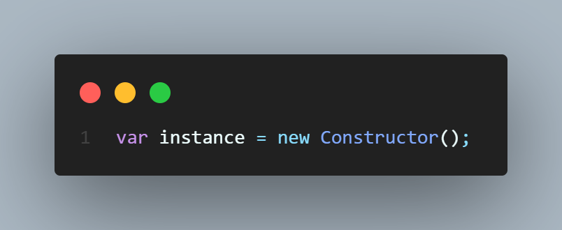
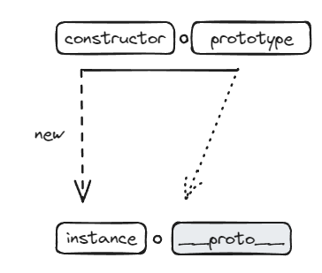
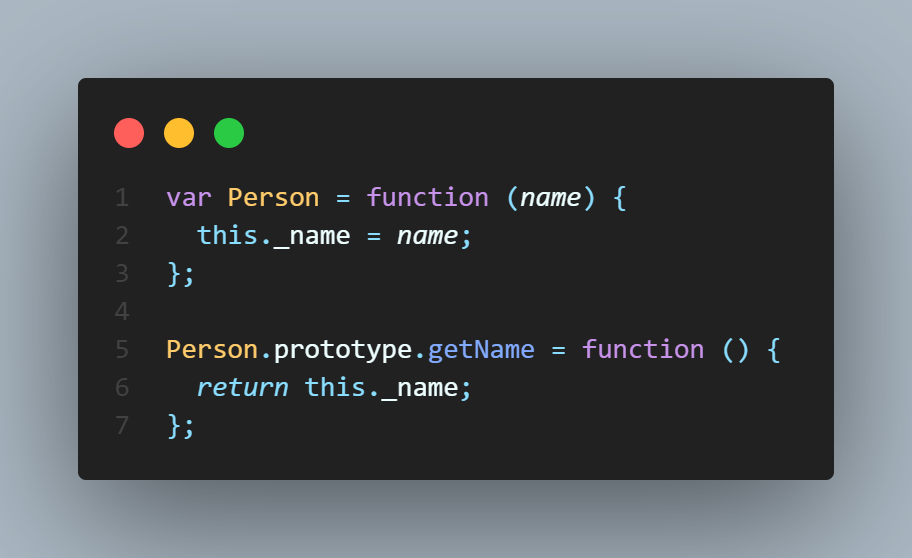
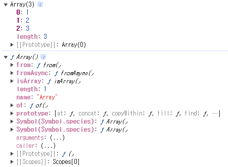

# constructor, prototype, instance





prototype은 객체이며 \_\_proto\_\_ 는 Constructor의 prototype을 참조한다. 따라서 \_\_proto\_\_ 도 객체이다.

ES5.1명세에서 \_\_proto\_\_는 [[prototype]]이라는 명칭으로 정의되어 있으나 대부분의 브라우저들이 직접 접근하게 만들었고 Object.getPrototypeOf(instance)/Refelect.getPrototypeOf(instance)를 통해서만 접근할 수 있었습니다. ES6에서는 레거시 코드에 대한 호환성 유지 차원에서 정식으로 인정하였다.
실무에서는 \_\_proto\_\_보다 Object.getPrototypeOf()/Object.create() 등을 이용하는 것이 좋다.



생성자 함수 예시

```javascript
var harry = new Person("Harry");
harry.__proto__.getName(); // undefined
```

```javascript
Person.prototype === suzi.__proto__; // true
```

harry.\_\_proto\_\_.getName(); // undefined

1. TypeError가 아니라 undefined가 나왔으므로 getName 함수는 실행이 되었다.
2. 함수를 메서드로 호출하면 메서드 명 바로 앞의 객체인 harry.\_\_proto\_\_가 this가 된다.
3. harry.\_\_proto\_\_ 객체 내부에는 name프로퍼티가 없으므로 undefined를 반환한다.

```javascript
var harry = new Person("Harry");
harry.__proto__._name = "Harry__proto__";
harry.__proto__.getName(); // 'Harry__proto__'
```

```javascript
var harry = new Person("Harry");
harry.getName(); // 'Harry'
```

harry.getName(); // 'Harry'

1. 함수를 메서드로 호출하여 바로 앞의 객체인 harry가 this가 된다.
2. harry 객체 내부에는 name 프로퍼티가 존재하여 Harry가 출력이 된다.

**\_\_proto\_\_는 생략 가능한 프로퍼티기 때문에 위와 같이 사용할 수 있다.**

```javascript
var arr = [1, 2, 3]; // var arr = new Array(1, 2, 3);
console.dir(arr);
console.dir(Array);
```



[1, 2, 3]의 [[prototype]] (=\_\_proto\_\_) 와 Array의 prototype이 같다.
Array의 prototype 내부에 자주 사용하는 메서드인 push, pop, forEach, map, sort 등등이 있다.

from(), isArray(), of(), arguments, length등 인스턴스가 직접 호출할 수 없다는 것을 알 수 있다.
