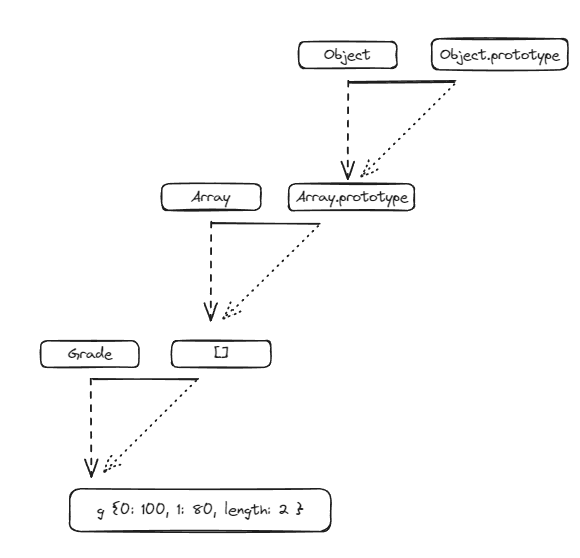

# 클래스 상속

### 7-3-1. 기본 구현

ES5까지 프로토타입 체인을 활용해 클래스 상속을 구현하였다. (ES6에서 자바스크립트에 클래스가 도입됨)

```javascript
var Grade = function () {
  var args = Array.prototype.slice.call(arguments);
  for (var i = 0; i < args.length; i++) {
    this[i] = args[i];
  }
  this.length = args.length;
};
Grade.prototype = [];
var g = new Grade(100, 80);
```

(length가 삭제가 가능하며 Grade.prototype이 빈 배열을 참조하고 있음)



length가 삭제되는 문제

```javascript
g.push(60);
console.log(g); // Grade {0:100, 1: 80, 2: 60, length: 3}

delete g.length;
g.push(70);
console.log(g); // Grade {0:70, 1: 80, 2: 60, length: 1}
```

g.\_\_proto\_\_ (=Grade.prototype)이 빈 배열을 가리키고 있었기 때문에 g.length가 지워지면 프로토 타입 체이닝을 타고 g.\_\_proto\_\_.length를 가져오게 되어 0을 할당 후 push로 1이 된다

#### 직사각형과 정사각형 클래스처럼 만들어보기.

```javascript
var Rectangle = function (width, height) {
  this.width = width;
  this.height = height;
};
Rectangle.prototype.getArea = function () {
  return this.width * this.height;
};
var rect = new Rectangle(3, 4);
console.log(rect.getArea()); //12

var Square = function (width) {
  this.width = width;
};
Square.prototype.getArea = function () {
  return this.width * this.width;
};
var sq = new Square(5);
console.log(sq.getArea());
```

1. Square를 변형시켜 getArea를 수정

```javascript
var Square = function (width) {
  this.width = width;
  this.height = width;
};
Square.prototype.getArea = function () {
  return this.width * this.height;
};
```

2. 정사각형이 width와 height가 같은 직사각형이므로 상속

```javascript
var Square = function (width) {
  Rectangle.call(this, width, width);
};
Square.prototype = new Rectangle();
```

```javascript
var sq = new Square(5);
console.log(sq);
```

sq는 Square의 인스턴스

sq.\_\_proto\_\_는 Square.prototype이자 Rectangle의 인스턴스

sq.\_\_proto\_\_.\_\_proto\_\_는 Rectangle.prototype이자 Object의 인스턴스

문제점

1. sq.\_\_proto\_\_는 Rectangle의 인스턴스로 width와 height를 정의해주지 않아 undefined가 나온다. sq.\_\_proto\_\_에 값을 부여하고 sq.width를 지워버리면 length를 제거한 것처럼 프로토타입 체이닝에 의해 의도하지 않은 값이 나올 수 있다.
2. sq.constructor()가 Rectangle을 가리키고 있으므로 의도하지 않는 결과가 나올 수 있다.
