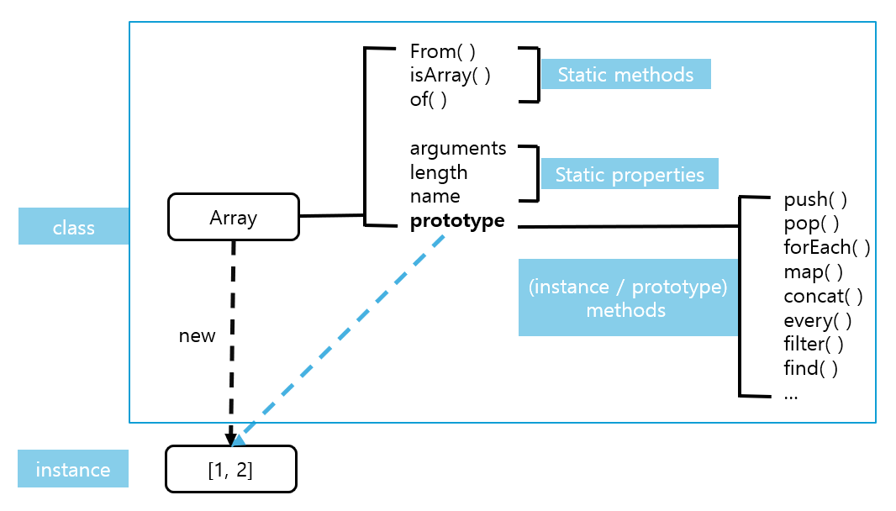
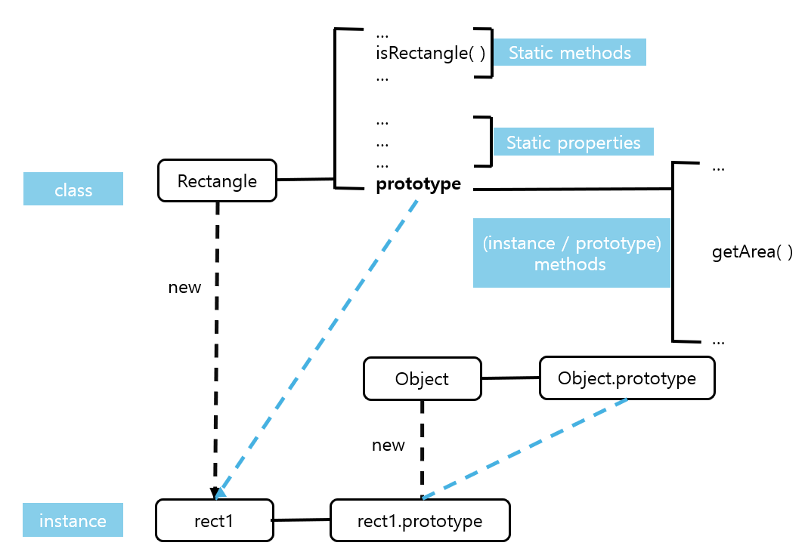
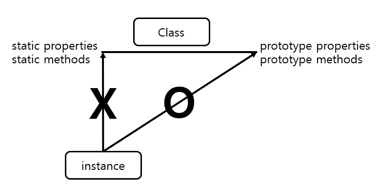

# 클래스
## 클래스와 인스턴스의 개념 이해
- **클래스**: 어떤 사물의 공통 속성을 모아 정의한 추상적인 개념
- **인스턴스**: 클래스의 속성을 지니는 구체적인 사례
- **상위 클래스(superclass)** 의 조건을 충족하면서 더욱 구체적인 조건이 추가된 것을 **하위 클래스(subclass)** 라고 한다.

## 자바스크립트의 클래스
자바스크립트는 프로토타입 기반 언어이므로 클래스의 개념이 존재하지 않는다. 프로토타입에 클래스 개념을 적용하여 해석할 수 있다. 
 
    
생성자 함수 Array를 new 연산자로 호출하면 인스턴스가 생성된다.  
Array를 클래스라고 가정하면, Array의 prototype 객체 내부 요소들이 인스턴스에 '상속'된다고 볼 수 있다.(프로토타입 체이닝에 의한 참조)   
Array 내부 프로퍼티들 중 prototype 프로퍼티를 제외한 나머지는 인스턴스에 상속되지 않는다.  
```js
var Rectangle = function (width, height) {//생성자
    this.width = width;
    this.height = height;
};
Rectangle.prototype.getArea = function () {//(프로토타입) 메서드
    return this.width * this.height;
};
Rectangle.isRectangle = function (instance) {//스태틱 메서드
    return instance instanceof Rectangle && instance.width>0 && instance.height>0;
};

var rect1 = new Rectangle(3, 4)
console.log(rect1.getArea());//12
console.log(rect1.isRectangle(rect1));//VM47:14 Uncaught TypeError: rect1.isRectangle is not a function
console.log(Rectangle.isRectangle(rect1));//true
```
    
- **프로토타입 메서드**: 클래스의 prototype 내부에 정의된 메서드.인스턴스가 마치 자신의 것처럼 호출할 수 있다.
- **스태틱 메서드**: 클래스(생성자 함수)에 직접 정의한 메서드. 인스턴스가 직접 호출할 수 없고 클래스(생성자 함수)에 의해서만 호출할 수 있다.

   

<hr>

클래스는 사용하기에 따라 추상적일수도 있고 구체적일 수도 있다.
- **추상적 개념**: 구체적인 인스턴스가 사용할 메서드를 정의한 '틀'의 역할을 담당하는 목적을 가질 때이다.
- **구체적 개념**: 클래스 자체를 this로 해서 직접 접근해야만 하는 스태틱 메서드를 호출할 때의 클래스는 하나의 객체로 취급한다.