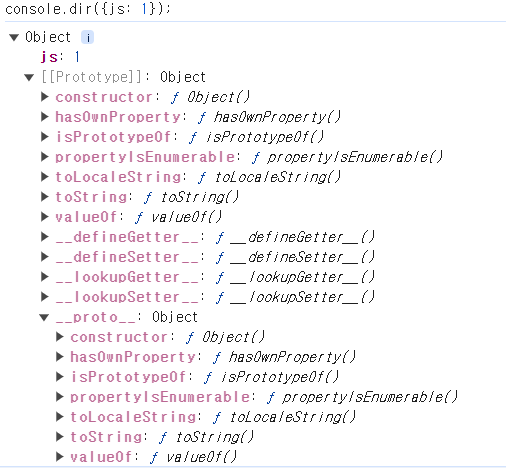
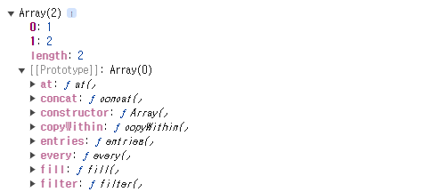
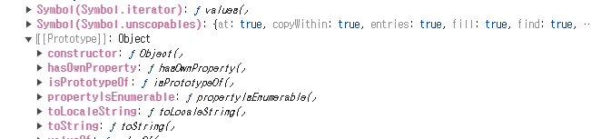
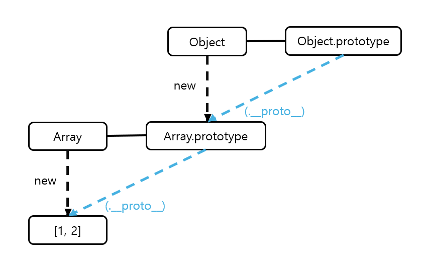
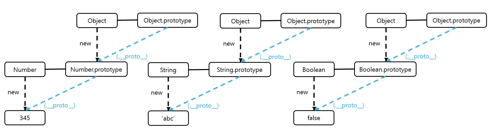
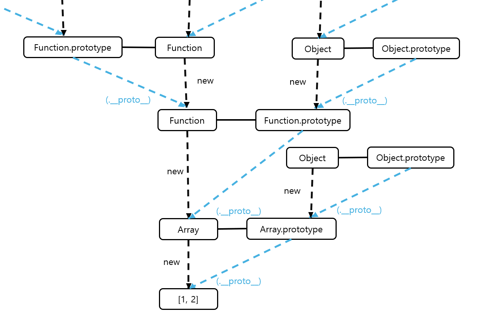

# 프로토타입 체인
`[[prototype]] = __proto__`
## 객체의 내부 구조

Object의 인스턴스이다. 프로퍼티 js의 값 1을 확인할 수 있다.  [[Prototype]]내부에는 메서드가 있다.  constructor는 생성자 함수인 Object를 가리키고 있다.

## 배열의 내부 구조
```js
console.dir([1, 2]);
```
  
(중략)

[[Protoype]] 안에 [[Prototype]]이 있다. 이는 prototype 객체가 '객체'이기 때문이다. 모든 개체의 [[proto]]에는 Object.prototype이 연결된다.



생략 가능한 `__proto__`를 한 번 더 따라가면 Object.prototype을 참조할 수 있습니다. 그래서 Array.prototype 내부 메서드와 Object.prototype 내부의 메서드를 실행할 수 있다.

## 프로토타입 체인(prototype chain)
- **프로토타입 체인(prototype chain)**: 어떤 데이터의 `__prototype__`프로퍼티 내부에 다시  `__prototype__`프로퍼티가 연쇄적으로 이어진 것

- **프로토타입 체이닝(prototype chaining)**:프로토타입 체인을 따라가며 검색하는 것
```js
var arr = [1, 2];
Array.prototype.toString.call(arr); //1,2
Object.prototype.toString.call(arr); //[object Array]
arr.toString(); //1,2

arr.toString = function () {
    return this.join('_');
};
arr.toString(); //1_2
```
## 데이터 타입별 프로토타입 체인

- 상단 우측 꼭짓점 무조건 Object.prototype? -- O(6-2-3절)

- 삼각형은 꼭 두개만 연결? -- X(6-2-4절)

## 전체 프로토타입 구조

각 생성자 함수는 모두 함수이기 때문에 Function 생성자 함수의 prototype과 연결된다. Function 생성자 함수 역시 함수이므로 다시 Function 생성자 함수의 prototype과 연결된다.  

실제 메모리상에서 데이터를 무한대의 구조 전체를 들고 있는 것이 아니고, instatnce.constructor.constructor나 instatnce.constructor.constructor.construtor나 모두 같은 Function 생성자 함수를 가리키므로 메모리가 낭비되지 않는다.
